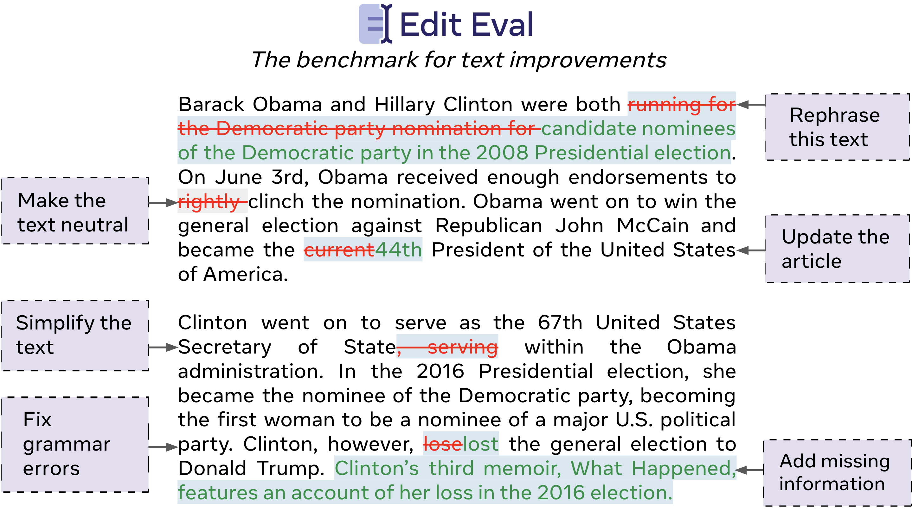

<!--  -->
<p align="center">

</p>


# The Instruction-Based Benchmark for Text Improvements

The EditEval benchmark is described in the following paper: [https://arxiv.org/abs/2209.13331](https://arxiv.org/abs/2209.13331)

```
@inproceedings{dwivedi-edit-2022,
  doi = {10.48550/ARXIV.2209.13331},
  url = {https://arxiv.org/abs/2209.13331},
  author = {Dwivedi-Yu, Jane and Schick, Timo and Jiang, Zhengbao and Lomeli, Maria and Lewis, Patrick and Izacard, Gautier and Grave, Edouard and Riedel, Sebastian and Petroni, Fabio},
  keywords = {Computation and Language (cs.CL), Machine Learning (cs.LG), FOS: Computer and information sciences, FOS: Computer and information sciences},
  title = {EditEval: An Instruction-Based Benchmark for Text Improvements},
  publisher = {arXiv},
  year = {2022},
  copyright = {Creative Commons Attribution Non Commercial Share Alike 4.0 International}
}
```

## Leaderboard

The leaderboard for this benchmark can be found on [EvalAI](https://eval.ai/web/challenges/challenge-page/1866/manage).  

## Installation

```
conda create -n editeval -y python=3.7 && conda activate editeval
pip install -e .
```
## Additional dependencies

The [FRUIT](https://github.com/google-research/language/tree/master/language/fruit) dataset requires that you install [gsutil](https://cloud.google.com/storage/docs/gsutil_install).

## Downloading datasets

This will download to the directory /data. To specify a different output directory use ```output_directory={path_to_output_dir}```.

For a single dataset run: 

    python main.py --dataset_name {dataset_name}

For all datasets run: 

    python main.py --dataset_name all

## Writing datasets to jsonl files

For a single dataset run:

    python main.py --dataset_name {dataset_name} --write_to_jsonl

For all datasets run:

    python main.py --dataset_name all --write_to_jsonl

## Sampling datasets

    python main.py --dataset_name jfleg --sample {num_examples_to_sample}

## Running evaluation for a dataset

    python main.py --dataset_name {dataset_name}  --prediction_file {path_to_jsonl}

To specify certain metrics (e.g., gleu and sari): 

    python main.py --dataset_name {dataset_name}  --prediction_file {path_to_jsonl} --metrics gleu sari

To turn off normalization during evaluation, specify ```--no_normalization```.

# Current tasks and datasets
- Fluency
    - jfleg
    - iterater_fluency
- Clarity
    - iterater_clarity
- Coherence 
    - iterater_coherence
- Paraphrasing
    - stsb_multi_mt
- Simplification
    - turk
    - asset
- Neutralization
    - wnc
- Updating
    - fruit
    - wafer_insert
    
# Current metrics
- sari
- em
- em_diff
- bleu
- ibleu
- gleu
- rouge
- update_rouge
- bert_score

## Licensing

See our LICENSE file for licensing details.
